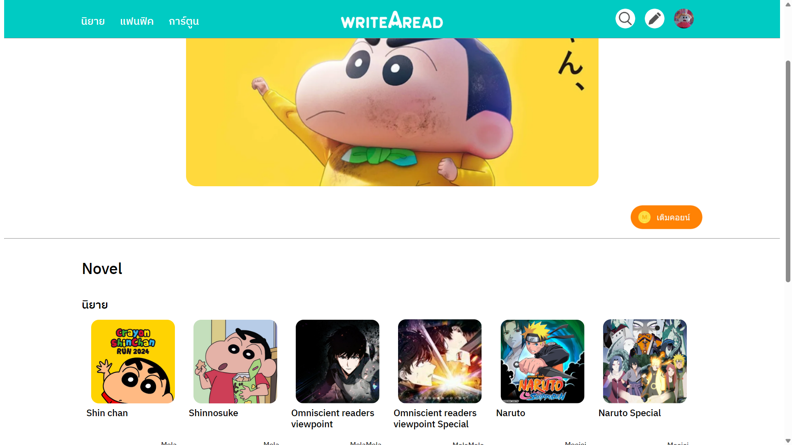
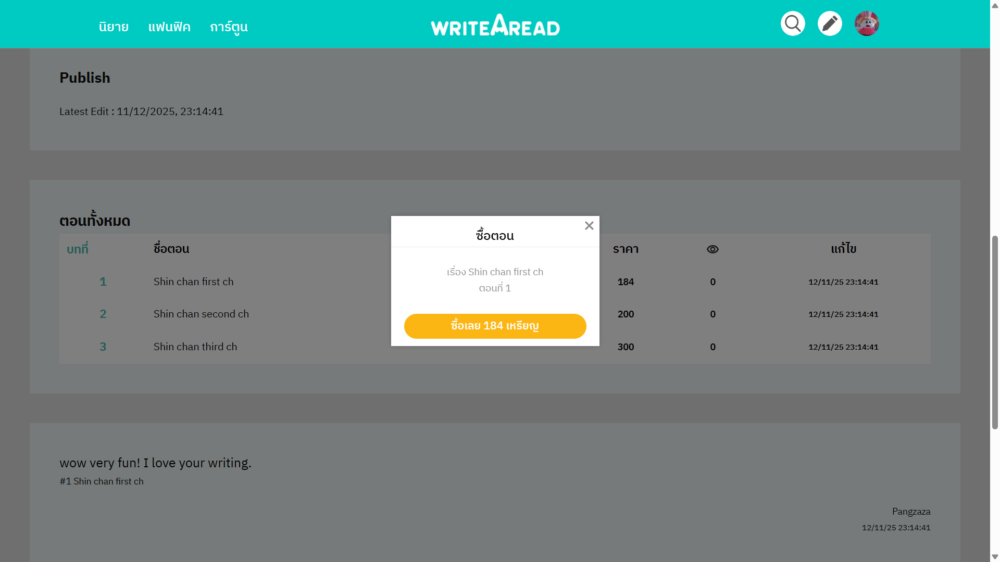

# 📖 WriteARead
A novel-reading website developed based on **ReadAWrite**. The website allows users to read, publish and interact with the novels. This was my first full-stack website project, built as part of the Object-Oriented Programming course.

## 🖼️ Demo



## 🛠️ Tech Stack
- **Frontend:** HTML, CSS, JavaScript  
- **Backend:** Python, FastAPI, Uvicorn 
- **Other:** Jinja2 Templates

## ✨ Features
- **Browse novels** – View lists of available novels.
- **Read chapters** – Simple reading interface.
- **User accounts** – Register, log in, manage profile.
- **Publish novels** – Authors can upload their novels.
- **Comments & interactions** – Readers can comment on chapters.
- **Top-up system** – Users can buy coins to read chapter.

## 🔧 Installation
1. Clone the repository  
   ```bash
   git clone https://github.com/jueeeeeen/WriteARead.git
   ```
2. Navigate into the folder
    ```bash
   cd WriteARead
   ```
3. Install dependencies
    ```bash
   pip install -r requirements.txt
   ```

## 🚀 How to Run
1. Start the development server
    ```
    uvicorn app.main:app --reload
    ``` 

2. Open your browser and visit

    ###### Web page: 
    ```
    http://127.0.0.1:8000/
    ```
    ###### API documentation:: 
    ```
    http://127.0.0.1:8000/docs
    ```
